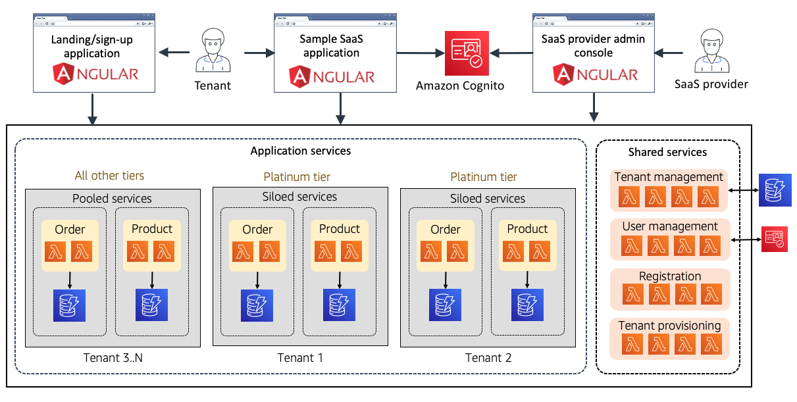
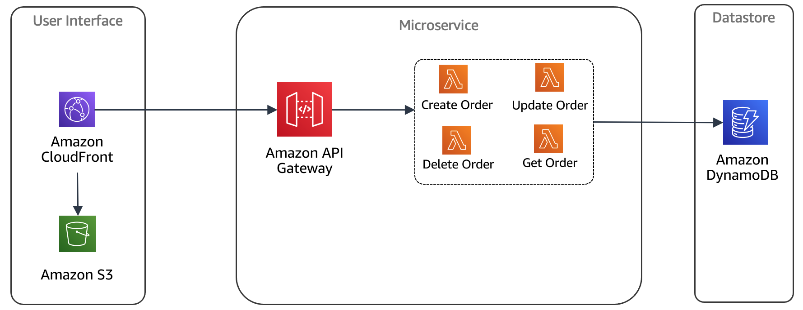
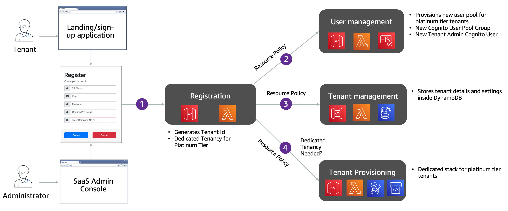
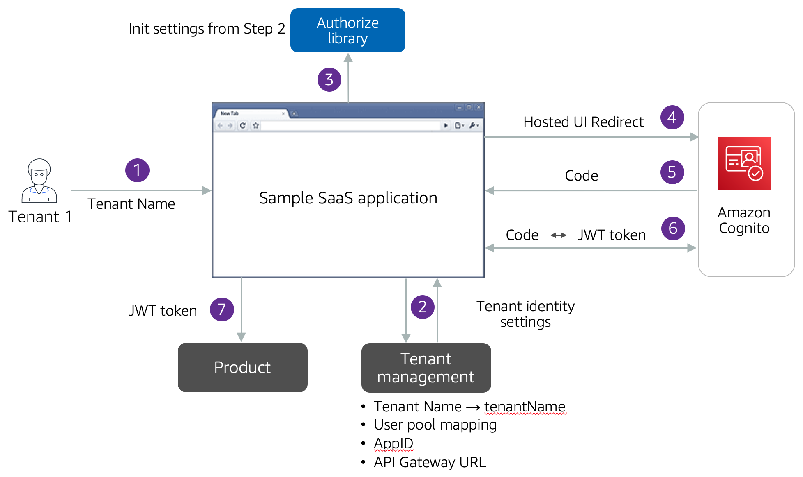
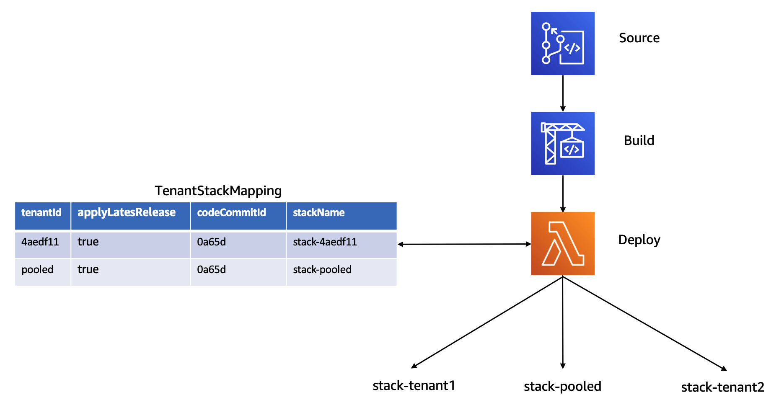
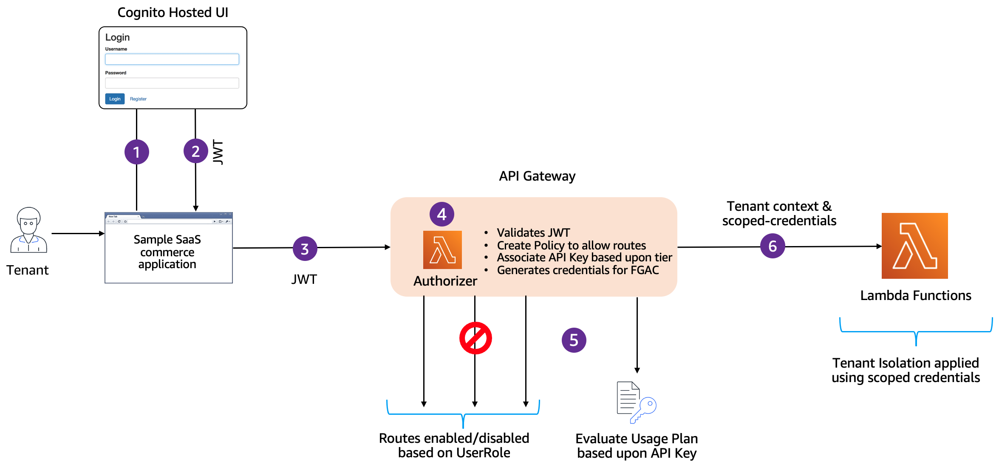
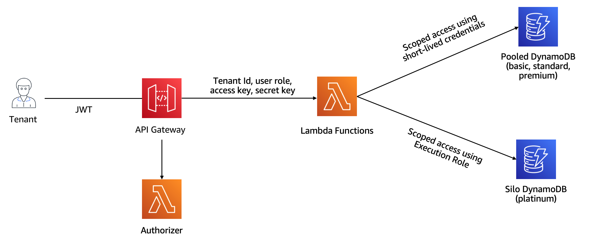
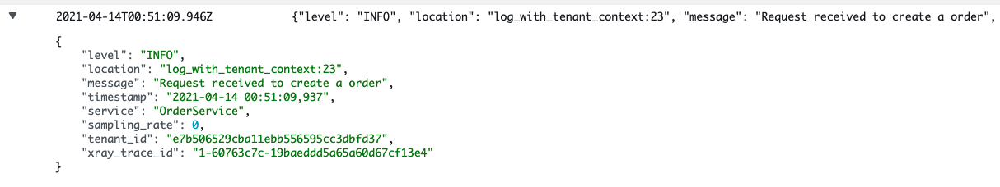
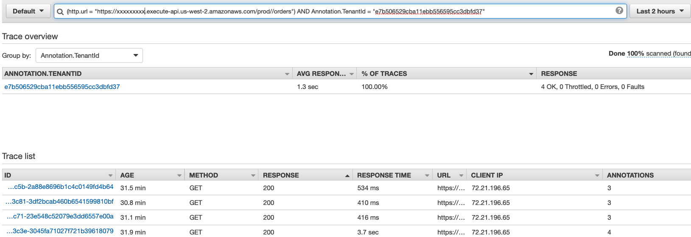
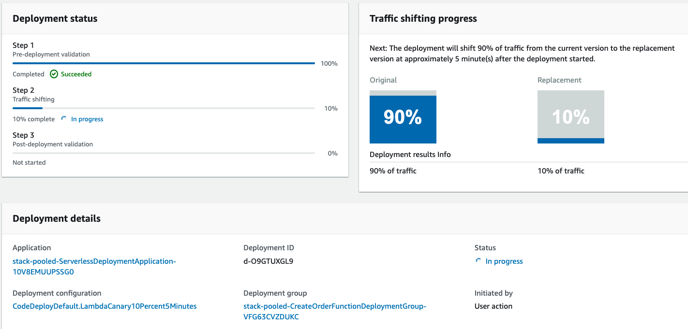

This section details the architecture of this SaaS Solution. Refer [README.md](README.md) for deployment instructions.

- [Overview](#overview)
- [High Level Architecture](#high-level-architecture)
  * [Web Applications](#web-applications)
  * [Shared Services](#shared-services)
  * [Application Services (Tiered Deployment Model)](#application-services--tiered-deployment-model-)
- [Baseline Infrastructure Provisioning](#baseline-infrastructure-provisioning)
  * [Web Applications](#web-applications-1)
    + [Landing/Sign-up Page](#landing-sign-up-page)
      - [Tenant Admin creation](#tenant-admin-creation)
    + [Admin Application](#admin-application)
    + [SaaS Application](#saas-application)
  * [Application API](#application-api)
    + [Serverless Microservices](#serverless-microservices)
    + [Usage Plans & Reserved Concurrency by Tenant Tiers](#usage-plans---reserved-concurrency-by-tenant-tiers)
  * [Shared Services](#shared-services-1)
    + [Tenant Registration](#tenant-registration)
    + [User Management](#user-management)
    + [Tenant Management](#tenant-management)
    + [Tenant Provisioning](#tenant-provisioning)
  * [Pooled Application Services](#pooled-application-services)
    + [Partition Key Structure](#partition-key-structure)
- [Tenant Registration & Onboarding](#tenant-registration---onboarding)
  * [Login as an onboarded tenant](#login-as-an-onboarded-tenant)
  * [Tenant provisioning with CodePipeline](#tenant-provisioning-with-codepipeline)
- [API Authorization and Tenant Isolation](#api-authorization-and-tenant-isolation)
  * [Authentication & Authorization](#authentication---authorization)
  * [Generating tenant isolation policies](#generating-tenant-isolation-policies)
  * [Applying Tenant Isolation inside Lambda](#applying-tenant-isolation-inside-lambda)
  * [Alternate approaches to Tenant Isolation](#alternate-approaches-to-tenant-isolation)
- [Hiding tenant details with Lambda Layers](#hiding-tenant-details-with-lambda-layers)
    + [Tenant aware logging, metrics, and tracing](#tenant-aware-logging--metrics--and-tracing)
- [Canary deployments to AWS Lambda](#canary-deployments-to-aws-lambda)
- [Conclusion](#conclusion)

# Overview

The move to a software-as-a-service (SaaS) delivery model is accompanied by a desire to maximize cost and operational efficiency. This can be especially challenging in a multi-tenant environment where the activity of tenants can be difficult to predict. Finding a mix of scaling strategies that align tenant activity with the actual consumption of resources can be elusive. The strategy that works today might not work tomorrow.

These attributes make SaaS a compelling fit for a serverless model. By removing the notion of servers from your SaaS architecture, organizations can rely on managed services to scale and deliver the precise number of resources your application consumes. This simplifies the architecture and operational footprint of your application, removing the need to continually chase and manage scaling policies. This also reduces the operational overhead and complexity, pushing more of operational responsibility to managed services.

To illustrate the architecture and design considerations, we have created the sample implementation that covers many of the common patterns and strategies that are used when creating multi-tenant solutions in serverless environments. This solution demonstrates fundamental concepts, such as, onboarding & identity, tenant and user management, authentication & authorization, data partitioning, tenant isolation, automated deployment, and multi-tenant observability.

This solution also introduces the concepts of tenant tiers, highlighting how the profiles of your different tenants influence your SaaS architecture.

# High Level Architecture

Figure 1 represents the high-level architecture of this sample implementation. The architecture is comprised of three logical components; user interfaces or web applications, application or business services and a set of shared services.

<p align="center">Figure 1: High Level Architecture</p>


## Web Applications

You will see that we have built three different applications that interact with the backend services of the environment. Each of these applications are built with AngularJS.

The "SaaS Provider Admin console" represents an application that is typically used by the administrators of a SaaS provider. These administrators can perform operations, such as, provisioning a new tenant, updating an existing tenant, and adding/updating users in the system. They can also disable and enable tenants/users as needed. 

The "Landing/sign-up application" serves as a public facing registration page for new tenants to register themselves. The "Registration" API is an unprotected endpoint which any new tenant can use to register themselves into the system. This step also creates a new tenant admin user.

The "Sample SaaS commerce application" represents a typical e-commerce application. It requires users to sign-in to access its features. The tenant admins can use this application to create new users within their organization. This application also includes some minimal functionality to simulate a SaaS application, allowing you to create/update products and orders.

## Shared Services

You will see a set of Shared services which are responsible for onboarding, tenant, and user management aspects of the application. The name "shared" comes from the fact that they are shared across all the tenants. This means that all the tenants and their users are managed centrally, through a central datastore and identity management system.

## Application Services (Tiered Deployment Model)

Application services are a representation of business services or microservices your SaaS application will typically consist of. SaaS providers often are required to support a range of tiers that may have different requirements around isolation, noisy neighbor, performance, etc. for these microservices. In these situations, they may use tiering to offer different experiences to their customers.

This could mean that microservices for Basic, Standard, and Premium tier tenants might be deployed using a Pooled Model where AWS resources are shared by tenants. On the other hand, Platinum tier tenants could be deployed with a Silo model. This means, each Platinum tier tenant enjoys their own set of AWS resources, without sharing them with any other tenant. There are variations of this where only parts of the system could be siloed (storage or certain microservices, for example).

For this solution, we've illustrated the example outline above. As new tenants are onboarded, they will be placed in a pool or a silo based on their tier. Basic, Standard, and premium tiers tenants will go into pool, which means they will share the infrastructure related to product and order services. Platinum tenants will go into a silo and each one of them will have their own product and order service. It is worth mentioning at this point, that although pooled tenants share common set of resources, but are still logically isolated using the tenant isolation mechanisms, as described in later sections.

The sections below provides more details, along with other architectural and design patterns that comes as part of this reference implementation. The deployment is broken down in two parts, baseline infrastructure and tenant-level infrastructure. We will examine both, one at a time, and the underlying AWS resources provisioned by them. This sample solution uses [AWS SAM](https://aws.amazon.com/serverless/sam/) to provision all its AWS resources.

# Baseline Infrastructure Provisioning

The instructions in the [README](README.md) file allows you install a baseline infrastructure of this architecture. Figure 2 provides a high-level representation of the architecture deployed as part of baseline infrastructure.

<p align="center">Figure 2: Baseline infrastructure</p>

Below are the details of AWS resources that are deployed as part of the baseline infrastructure.

## Web Applications

As also mentioned above, this reference architecture comes with three applications, namely; "Landing/Sign-up application", "SaaS provider admin console" and "Sample SaaS application". These applications are deployed with CloudFront and S3.

### Landing/Sign-up Page

The landing page is a simple, anonymous signup page. It's representative of our public-facing marketing page through which prospective tenants can sign-up. When you select the sign-up option, you will provide data about your new tenant and submit that information to the system's registration service. This service will then create and configure all the resources needed to introduce a new tenant into the system.

#### Tenant Admin creation

As part of this sign-up/onboarding flow, the system will also create a tenant admin user and send a verification email to the address that was provided during sign-up. The information in this email will allow you to access the system with a temporary password. This Tenant Admin user can now provision more tenant users as needed, using the "Sample SaaS Application", described below.

### Admin Application

The administration application is meant to represent the experience that would be used by a SaaS Provider. This application provides the management and operations experience for your environment and its tenants.

We have provisioned an admin user as part of baseline infrastructure, based upon the email address provided as part deployment. The system sends an email with the username and password information for the admin user. You should be able to use this information to login into the admin interface to explore it further. Administrative user are authenticated by Amazon Cognito, using a user pool that is specifically created for them.

### SaaS Application

The sample SaaS application is a basic e-commerce application that is here as a placeholder to illustrate how your application would authenticate users and interact with the application's microservices.

As mentioned above, we have followed a tiered deployment model. Our SaaS application asks for tenant name as part of sign-in process. The user is then redirected to the relevant Cognito hosted UI where you can provide user name and password to sign-in.

Once authenticated, the client app illustrates basic microservice interaction with two multi-tenant microservices: product and order. The idea here is that each tenant can add some number of products, which then serve as line items in a subsequent tenant order.

You can use the tenant admin user created during sign-up process to login into this application. You can also create more users inside your tenancy, as needed.

## Application API

The application and shared services of the serverless SaaS environment are accessed through the API Gateway. The baseline infrastructure creates the resources, methods, and lambda functions necessary to create and deploy our microservices.

### Serverless Microservices

The notion of microservices in case of AWS Serverless technologies encapsulates various AWS Services and features inside them. In this case our microservice boundary is the API Gateway, backed by one of more Lambda functions. Each microservice can further also have one or more data stores. Figure 3 gives a high-level representation of this concept.

<p align="center">Figure 3: Serverless Microservices</p>

### Usage Plans & Reserved Concurrency by Tenant Tiers

It is common for SaaS providers to offer different experiences to each type (tier) of tenant that is using the system. Throttling is usually part of a broader tiering strategy where basic tier tenants, for example, have throttling policies that limit their ability to impact the experience of higher tier tenants.

This tiering strategy could be used to restrict requests according to pricing agreements, maintain service level agreements across tenant tiers, and, most importantly, limit the possibility of noisy neighbor issues.

The serverless SaaS sample solution applies these tier-based strategies through the API Gateway. The API Gateway allows you to create [Usage Plans](https://docs.aws.amazon.com/apigateway/latest/developerguide/api-gateway-api-usage-plans.html) which can be associated with the API key to achieve this. In our case, we have one usage plan for each tenant tier (basic, standard, premium, and platinum). We have associated the API keys with these usage plans to ensure tenant level throttling limits.

Depending upon your scenario, you might consider having one usage plan per tenant as well. This is usually the case when you have limited number of tenants. In this case, your registration and provisioning service would have to create the API key and usage plan during onboarding.

Another thing to consider while designing a serverless application, especially with Lambda, is the concurrent execution limits of Lambda. As per the Lambda quotas documentation, although this can be increased to hundred of thousands, but it is still a good idea to ensure that your Platinum tier tenants are not throttled, because other tiers are consuming concurrency quota.

To achieve this, we have implemented reserve concurrency for certain methods, only for platinum tier tenants.

## Shared Services

The shared services refer to the common set of services that are core to any SaaS environment. These services provide all the mechanisms that are need to have a universal view of how tenants are onboarded, managed, and operated in SaaS environment. For this solution, we've provided the foundational shared services, including microservices for Tenant Registration, Tenant Provisioning, Tenant Management and User Management. These represent a starting point for your serverless SaaS environment. Additional services like analytics, billing, and metering, for example, would be part of your complete shared services experience.

Let's dive into the details of these microservices, one at a time.

### Tenant Registration

The Tenant Registration service allows new tenants to register themselves and onboard to your SaaS application. There are a few moving parts to this registration experience. This Tenant Registration service is responsible for orchestrating interactions with user management, tenant management and provisioning service that are part of the onboarding experience.

### User Management

This Shared Service is used to manage users inside Amazon Cognito. It allows to add, update, disable and get user. It also allows to get all users, disable all users, and enable all users by tenant.

### Tenant Management

Tenant management service handles get, create, update, activate and disable tenant operations. Tenant Details are stored inside an Amazon DynamoDB table.

### Tenant Provisioning

Tenant provisioning handles provisioning and de-provisioning of a tenant. This service is only invoked for Platinum tier tenants, since they are provisioned using a Silo stack. This service further reiles on AWS CodePipeline to manage the provisioning experience.

## Pooled Application Services

We have provisioned Order and Product services as part of baseline infrastructure, as a representation of business microservices that SaaS providers usually create as part of their SaaS Solution. These microservices use Amazon DynamoDB as their data store. The objectives of these services are to demonstrate the principles of tenant isolation and data partitioning that any SaaS provider need to implement inside their solutions.

In order to facilitate this, our API Gateway exposes "order" and "product" resources, which further have POST, GET, PUT and DELETE methods to support basic CRUD operations. Each of these methods integrates with a lambda function of its own to accomplish the needed operation.

As part of baseline infrastructure, we have created a pooled implementation of these microservices, which means that Basic, Standard and Premium tenants all share the same deployment of these services. On the other hand, we provision a new instance of order and product service for platinum tier tenants. That happens as part of the onboarding process, which has been described in the subsequent sections.

### Partition Key Structure

In order to understand the Data Partitioning strategy for pooled tenants, we need to understand the partitioning key we have chosen to implement inside DynamoDB. Take Product table, as an example. The primary key for Product table is a composite key, where shardId is the partition key and productId is the sort key. shardId is generated by combining tenantId with a random suffix, in a format of {tenantid}-{suffix}. This allows us to distinguish data across tenants and use the LeadingKey feature of DynamoDB to apply tenant isolation. Details around tenant isolation has been described in later sections.

You can read [this](https://aws.amazon.com/blogs/apn/partitioning-pooled-multi-tenant-saas-data-with-amazon-dynamodb/) blog post to get more details about this approach.

# Tenant Registration & Onboarding

Tenant can register themselves using the sign-up page. The tenant registration flow varies a little depending upon the tenant tier.

Figure 4 depicts the tenant registration flow and how this service leverages other services to orchestrate the tenant registration.

<p align="center">Figure 4: Tenant Registration & Onboarding</p>

The sign-up process for a tenant is a combination of few steps. The tenant uses the sign-up application to access the registration page, where they provide their information, along with the tier they intend to sign-up for. This kicks of the registration process by invoking the "registration" endpoint inside API Gateway, as shown in Step 1 of Figure 4.

As we mentioned earlier, the serverless SaaS architecture uses a tiered deployment model. This becomes especially important as we look at our registration experience. The registration service will examine the tier. If the tenant has selected a Platinum tier, the system will set the "isDedicatedTenancy" flag to true, indicating that this tenant will be onboarded in a siloed model (dedicated resources). If any other tier is selected, this flag will be set to false, indicating that the tenant will be onboarded in a pooled model (shared resources).

Step 2 of the flow invokes the User Management service to create a new tenant admin user. We have here used Cognito as our identity provider. For Platinum tier tenants, you'll notice that a separate user pool is provisioned. For other tiers, the User Management service will create a Cognito UserGroup inside the pooled user pool for that tenant. Finally, a tenant admin user is created for the tenant inside the user pool.

As part of creating the tenant admin user, we must also associate this user with tenant specific attributes. This is achieved through Cognito's custom claims. These claims store certain tenant and user specific information. For this solution we've stored TenantId and User Role as custom claims.

Step 3 will then call the Tenant Management service to create a new entry inside DynamoDB table to store tenant details. We also store the user pool information for the tenant, based upon the output from prior step. Tenant management table also keep track of the API key based upon the tenant tier selected.

Finally in step 4, tenant provisioning service is used to provision any tenant specific infrastructure for Platinum/silo tenants. It makes use of AWS CodePipeline to manage the deployment of tenant specific application services. More details around this CodePipeline is provided in later sections.

One thing you might have noticed is that tenant registration service doesn't have any authentication built-in. This is by design so that tenants can come and register themselves in. However, the endpoints that are used to create a tenant admin, create a tenant, and provision a user cannot be left un-protected. These endpoints can only be invoked from the Tenant Registration service.

To keep these internal endpoint private and protected, we have used the [API Gateway Resource Policies](https://docs.aws.amazon.com/apigateway/latest/developerguide/apigateway-resource-policies.html) feature. These policies ensure that the private REST entry points of our services are not publicly accessible.

## Login as an onboarded tenant

As mentioned above, the user management service creates a tenant admin user as part of the registration process. User management service uses the email address, provided during registration, to send an email with login information of this newly created user. The tenant admin can now use this information to login into the SaaS application.

Once logged in, they can onboard new tenant users into the system. These users naturally exist in the context of this tenant now and can only access orders and products that have been created by users belonging to this tenant.

Given the hybrid nature of our application, and the fact that we are creating separate Cognito user pools and separate Application APIs for platinum tier tenants, it is important to understand how our web application do the discovery of the tenant specific settings for routing purposes. Figure 5 below, illustrates this discovery and routing mechanism.

<p align="center">Figure 5: Authentication flow</p>

In Step 1, tenant user is required to enter the tenant's name as part of login process. This tenant name is same as provided during registration process.

Step 2 uses tenant name to retrieve tenant specific information, namely user pool id, app client id and API Gateway URL. This information is passed onto the SaaS web application, which uses it to initialize the authorization code with these settings, as seen in Step 3.

This experience can be modified according to your needs. As an example, you can ask for user email address and use the email domain name to retrieve the necessary information. Another way could be to create subdomain for each tenant, such as tenant1.yoursaasapplication.com.

The application will then redirect to the Cognito hosted UI, associated with that tenant, as seen in Step 4. This is where the user is required to provide his username and password.

Step 5 and 6 are representation of the Authorization code grant flow of Cognito. Cognito uses username and password to authenticate against the user pool. Once the login information is successfully validated, it issues an OAuth code in return. This OAuth code is sent back to Cognito which in return issues a JWT token. Step 7 shows how you can use the JWT token to authenticate against your microservices. More details around Step 7 are provide in the API Authorization section later.

## Tenant provisioning with CodePipeline

Tenant CodePipeline is responsible for the deployment of application services (product and order service in our case).

This pipeline is responsible for provisioning the tenant specific infrastructure as part of the tenant registration process, for platinum tier tenants. Moving forward this pipeline also takes care of updating the tenant infrastructure using a CI/CD based approach. When you publish/merge your code to the main branch, the below pipeline will trigger automatically, build the source, perform all the necessary unit tests, and deploy the services for all your tenants in an automated fashion.

<p align="center">Figure 6: Tenant Pipeline</p>

Figure 6 provides a clearer picture of the moving parts of the deployment experience. You'll see that we've used CodeCommit to host our code repository. CodeBuild is used to build the SAM Application using the [tenant-buildspec.yml](server/tenant-buildspec.yml) file. The first two steps of the CodePipeline process are focused on acquiring the latest source and building it.

Once the build completes, a Lambda function is used to deploy the tenant infrastructure (more detail on how to invoke lambda inside CodeDeploy can be found [here](https://docs.aws.amazon.com/codepipeline/latest/userguide/actions-invoke-lambda-function.html)).

The TenantStackMapping Table is at the heart of this deploy step. This table is seeded with an entry for pooled stack (basic, standard, premium tier tenants) as part of baseline infrastructure deployment. We then use this pipeline to provision pooled application services during baseline infrastructure creation. Registration process further creates an entry inside this table for any new platinum tier tenant created. The CodePipeline uses this table to create and update stacks, as needed.

You will also notice the "applyLatestRelease" flag in the table. The intent here is to build a canary deployment across tenants. In some cases, you might want to delay the release for your Platinum tier tenants. In that case you can turn this flag off and the Pipeline will not roll out the release to those tenants. The table also, in this case, keeps track of the latest commit id from CodeCommit. This helps to identify the current deployed release number for that tenant.

# API Authorization and Tenant Isolation

As also mentioned before, we have used Cognito as our Identity Provider. The Web application uses Cognito's hosted UI to authenticate using a username and password. It is now the responsibility of API Gateway to ensure that only authenticated users can access the services. API Gateway also need to apply usage plans based upon tenant tier at this stage. Finally, our microservices need to implement tenant isolation based upon the tenant that is trying to access the system. We have leveraged [Lambda Authorizer](https://docs.aws.amazon.com/apigateway/latest/developerguide/apigateway-use-lambda-authorizer.html), Dynamic IAM Policies & [STS service](https://docs.aws.amazon.com/STS/latest/APIReference/welcome.html) to implement these controls.

## Authentication & Authorization

For the serverless SaaS solution, we have used a Lambda Authorizer as part of the authentication and authorization model of the environment. Once authenticated, Cognito issues a JWT token, that is passed with each request that is processed by the API Gateway.

Figure 7. represents a flow of how API Gateway enforces this authentication and authorization process.

<p align="center">Figure 7: Authorization Flow</p>

Step 1 and Step 2 are a representation of authentication flow that happens between the web application and Cognito Hosted UI. Once Authenticated the user is provided a JWT token that is used to invoke the API, as depicted in Step 3.

Lambda authorizer further carries out a series of steps to validate and authorize the request, as highlighted in Step 4 above.

The first action is to validate if the JWT is valid or not. This is achieved by validating the JWT against the user pool. Once validated, the authorizer then extracts the UserRole and TenantId from the validated Custom Claims.

Authorizer further allows methods/routes selectively based upon the user role. As an example, only system admin can get all tenants.

We have also set the [API key source](https://docs.aws.amazon.com/apigateway/latest/developerguide/api-gateway-api-key-source.html) of our APIs as AUTHORIZER. This means that the Authorizer is responsible for associating the API key with the incoming request.

Lambda authorizer in our case is also responsible for generating short lived credentials for fine-grained-access-control. We are dynamically generating IAM policy that is specific to that Tenant, based upon Tenant Id and UserRole.

Lambda Authorizer will now authorize the user based upon all these parameters and generates the final Policy, which allows the route and apply the Usage plan based up the API key returned by the Authorizer. Step 5 of the Figure 7 above illustrates this flow.

To add efficiency to this process, the Lambda Authorizer caches the credentials for X seconds (60 seconds in our case), based upon the JWT token. So, the above steps are only executed once per minute, per JWT token (or per user in other words). The number of seconds is configurable and can be customizes according to your needs.

## Generating tenant isolation policies

Tenant isolation refers to the controls applied to ensure that one tenant is not able to access other tenant's data. As also mentioned above, in our case Lambda Authorizer is responsible for generating the tenant isolation policies.

The Lambda Authorizer dynamically generates the IAM policy based upon the incoming tenant id. Below json snippet is an example of how this happens.

```
{
    "Effect": "Allow",
    "Action": [
        "dynamodb:UpdateItem",
        "dynamodb:GetItem",
        "dynamodb:PutItem",
        "dynamodb:DeleteItem",
        "dynamodb:Query"
    ],
    "Resource": [
        "arn:aws:dynamodb:{0}:{1}:table/Product-*".format(region, aws_account_id),                      
    ],
    "Condition": {
        "ForAllValues:StringLike": {
            "dynamodb:LeadingKeys": [
                "{0}-*".format(tenant_id)
            ]
        }
    }
}
```

In this snippet the "tenant_id" variable is a placeholder that gets replaced by the id of the incoming tenant. As a result, you will get a policy that is relevant for that tenant only.

The Lambda Authorizer then uses this IAM policy to generate fine-grained short-lived credentials using the [AssumeRole](https://docs.aws.amazon.com/STS/latest/APIReference/API_AssumeRole.html) method of STS Service. The outcome of this is a secret and access key which has access to the data for that tenant only.

This access and secret key are passed onto the Lambda function, which uses it to apply tenant isolation, as described in the following section.

## Applying Tenant Isolation inside Lambda

The Lambda function is responsible for interacting with the data store (DynamoDB in this case) and applying the tenant isolation mechanism during this interaction. The application of tenant isolation also varies by tenant tier, as shown in Figure 8 below.

<p align="center">Figure 8: Tenant isolation</p>

For pooled tenants, the lambda function uses the secret and access key provided by the Lambda Authorizer. As mentioned above, these credentials are scoped to access data for that tenant only.

The strategy for Silo tenants differs a bit, since we are provisioning siloed tables for them. There is no need to apply the scoped credentials while accessing the DynamoDB table. Instead, the tenant execution role, applied during provisioning of lambda functions, restricts access to the specific table provisioned for that tenant.

## Alternate approaches to Tenant Isolation

In our case the primary reason of generating scoped credentials inside Lambda Authorizer is to take advantage of the caching feature that comes with the Lambda Authorizer inside API Gateway. We are caching the authorization based upon the JWT token. Along with limiting the calls to Cognito, this also ensures that our code is not generating scoped credentials for every execution of the APIs, but rather cache it for certain time. The caching time will vary upon your needs from few seconds to few minutes depending upon your workload. The maximum allowed is 3600 seconds or one hour.

Another approach could be to generate scoped credentials inside your lambda function itself. This may allow you to fine-grain your policies further based upon the lambda function. This approach is described in more details [here](https://aws.amazon.com/blogs/apn/isolating-saas-tenants-with-dynamically-generated-iam-policies/).

# Hiding tenant details with Lambda Layers

As a general rule, SaaS solutions try to make development of microservices as simple as possible by introducing libraries or modules that will hide away many of the details associated with multi-tenancy. Logging, metrics, data access—they may all require tenant context, for example, and we don't want to require developers to have one-off code in each of their services to manage/access/apply this tenant context.

In a serverless environment, we have a natural mechanism that will allow us to introduce common code that can be used to address these common multi-tenant needs. The serverless SaaS architecture uses [Lambda Layers](https://docs.aws.amazon.com/lambda/latest/dg/configuration-layers.html) to centralize logging, metrics and tracing. We are also using [AWS Lambda Powertool](https://github.com/awslabs/aws-lambda-powertools-python) to write logs and metrics to CloudWatch and traces to X-Ray.

### Tenant aware logging, metrics, and tracing

To see this in action, let's look at how we've introduced tenant aware logging and metrics with Lambda Layers.

Let's start with logging. You'll see that with have created a "log\_with\_tenant\_context" method in [logger.py](server/layers/logger.py) that supports our tenant aware logging. This method, which is deployed to a lambda layer, extracts the tenant context directly from the event payload of the lambda itself. Figure 9, shows a sample log that has tenant context injected into the log content.

<p align="center">Figure 9: Tenant-aware logging</p>

The serverless SaaS architecture also has a lightweight version of how you can instrument your application with metrics. We have introduced a [metrics_manager.py](server/layers/metrics_manager.py) file in a Lambda Layer that provides a metrics helper that can record metrics with tenant context.

By calling the "record\_metric" method from your application, the system will record the metric which included the context of the tenant associated with that metric event. In Figure 10, you will see a sample metrics with tenant context.

<p align="center">Figure 10: Tenant-aware metrics</p>

If you look into the code of product and order service, you'll notice that we have used "@tracer.capture_lambda_handler" decorator above your lambda functions, provided by Lambda Powertools, along with a "tracer.put_annotation" method call. This was added to support tracing of your activity with X-Ray. This enables X-Ray to capture each and every call to the lambda function and add the tenant id as an annotation. Figure 11 below shows how you can use annotations to filter traces by tenant.

<p align="center">Figure 11: Tenant-aware Tracing</p>

# Canary deployments to AWS Lambda

SaaS based delivery model requires operational excellence. The tenants expect zero downtime and constant availability of your services. This requires a careful deployment strategy of your services, ensuring that new function versions are deployed with minimal impact.

Lambda Traffic shifting feature allows you to do just that. It allows you to slowly and incrementally shift traffic to the new function versions. Meanwhile, it also monitors the newly deployed functions using CloudWatch alarms and roll back the deployment in case errors are encountered in the newly deployed function version. We have implemented this across all the lambda functions in this solution.

Below code block is added to the lambda functions inside the CloudFormation to implement this.

```
AutoPublishAlias: live
      DeploymentPreference:
        Type: Canary10Percent5Minutes
        Alarms:
          - !Ref CreateProductFunctionCanaryErrorsAlarm
```

Canary is managed using CodeDeploy. CodeDeploy now monitors the below alarm and shifts the traffic to newly deployed lambda version, if there are no errors encountered (5 minutes in this case).

```
CreateProductFunctionCanaryErrorsAlarm:
Type: AWS::CloudWatch::Alarm
Properties:
    AlarmDescription: Lambda function canary errors
    ComparisonOperator: GreaterThanThreshold
    EvaluationPeriods: 2
    MetricName: Errors
    Namespace: AWS/Lambda
    Period: 60
    Statistic: Sum
    Threshold: 0
    Dimensions:
    - Name: Resource
        Value: !Sub "${CreateProductFunction}:live"
    - Name: FunctionName
        Value: !Ref CreateProductFunction
    - Name: ExecutedVersion
        Value: !GetAtt CreateProductFunction.Version.Version    
```

You can also view the status of the Canary deployment inside CodeDeploy. Figure 12 is an example of this looks like.

<p align="center">Figure 12: Canary deployment inside CodeDeploy</p>

# Conclusion

This document explored the core elements of the Serverless SaaS solution by providing a summary of the building blocks used in the overall experience. It should give you a better sense of how the application is built and allow you to more easily navigate the resources in the repository.

We encourage you to dig into the code and provide feedback to help us shape the evolution of this environment. We expect to continue to make enhancements to the solution and address new strategies as they emerge.