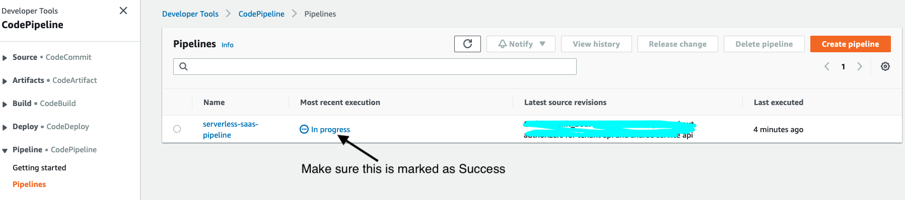
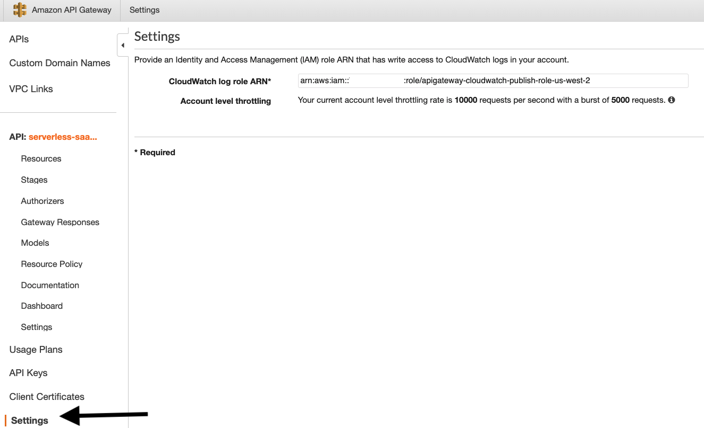

# Serverless SaaS - Reference Solution
The code in this repository is intended to provide a sample implementation of a SaaS solution using Serverless Technologies. The goal is to provide SaaS developers and architects with working code that illustrates how to design and deliver a multi-tenant SaaS on AWS. The solution covers a broad range of multi-tenant considerations, including onboarding & identity, tenant and user management, authentication & authorization, data partitioning, tenant isolation, automated deployment, and multi-tenant observability. It provides developers with a prescriptive approach around the fundamentals of building SaaS solution using Serverless Technologies, such as Amazon API Gateway, Amazon Cognito, AWS Lambda, Amazon DynamoDB and AWS CodePipeline. The focus here is more on giving developers a view into the working elements of the solution without going to the extent of making a full, production-ready solution. Instead, we're hoping this can jump start your process and address some of the common challenges that teams must address when delivering a Serverless SaaS solution.

Note that the instructions below are intended to give you step-by-step, how-to instructions for getting this solution up and running in your own AWS account. For a general description and overview of the solution, please see the developer's documentation [here](DOCUMENTATION.md).

## Pre-requisites
* This reference architecture uses Python. Make sure you have Python 3.8 Installed.
* Make sure you have [AWS CLI](https://docs.aws.amazon.com/cli/latest/userguide/cli-chap-install.html) Installed. 
* Make sure you have the latest version of [AWS SAM](https://docs.aws.amazon.com/serverless-application-model/latest/developerguide/serverless-sam-cli-install.html) installed.
* Make sure you have the latest version of [AWS CDK CLI](https://docs.aws.amazon.com/cdk/latest/guide/cli.html) installed.
* Make sure you have the latest version of [git-remote-codecommit](https://docs.aws.amazon.com/codecommit/latest/userguide/setting-up-git-remote-codecommit.html) installed.
* Make sure that you have Angular 11 or above
* Make sure that you have Node 12 or above.

## Setting up the environment
Run the below script to deploy the required component. Replace the "test@test.com" email address with yours. This email address is used to setup an admin user in the architecture.

```
. deployment.sh test@test.com
```

This script will take few minutes to complete. Once complete it will deploy the following:
* Bootstrap CDK in your account
* Deploy Tenant Pipeline using CDK. This pipeline uses CodePipeline and is responsible for auto updating the stack for all the tenants in an automated fashion.
* Deploy the bootstrap stack, which initializes the environment by setting up Cognito, DynamoDB tables and Shared services (Tenant registration, tenant management and user management)
* Deploy the pooled tenant stack, using code pipeline, which deploys the multi-tenant order and product services. 
* Deploy three web applications, namely "SaaS Provider Admin console", "Landing/sign-up application" and "Sample SaaS commerce application", using S3 and CloudFront. The script will output the URL for these three user interfaces, after it finishes.


Once the above script finishes successfully:
1) Go to the CodePipeline page, inside AWS Console, to make sure that the Pipeline has been deployed successfully. You might have to wait for few minutes before the Pipeline finishes.
<p align="center">
    
    <br>
    Figure1: Code Pipeline
</p>

2) If this is a new AWS account or if you are using API Gateway for the first time in this account, ensure that CloudWatch log role ARN is set for the API Gateway. In order to do so, go to the API Gateway page, inside AWS Console, and click on any one of the APIs listed. Click on Settings from the left navigation bar and provide an IAM role that have access to publish logs to CloudWatch.
<p align="center">
    
    <br>
    Figure 2: CloudWatch log role ARN
</p>

## License
This library is licensed under the MIT-0 License. See the LICENSE file.

## Security
See [CONTRIBUTING](CONTRIBUTING.md#security-issue-notifications) for more information.
