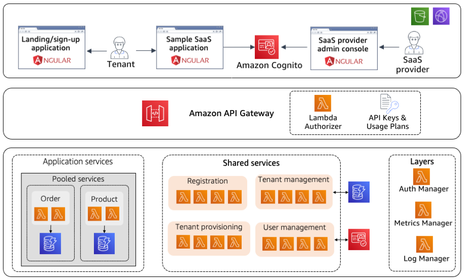

# Serverless SaaS - Reference Solution
**[Feedback & Feature request](https://github.com/aws-samples/aws-saas-factory-ref-solution-serverless-saas/issues/new)** | **[Documentation](DOCUMENTATION.md)**

**[UPDATE - 12/01/2021]** We have now also created a workshop that you can use as a reference to understand this reference solution in a step-by-step fashion. Workshop is available [here](https://github.com/aws-samples/aws-serverless-saas-workshop).

## Introduction
The move to a software-as-a-service (SaaS) delivery model is accompanied by a desire to maximize cost and operational efficiency. This can be especially challenging in a multi-tenant environment where the activity of tenants can be difficult to predict. Finding a mix of scaling strategies that align tenant activity with the actual consumption of resources can be elusive. The strategy that works today might not work tomorrow.

These attributes make SaaS a compelling fit for a serverless model. By removing the notion of servers from your SaaS architecture, organizations can rely on managed services to scale and deliver the precise number of resources your application consumes. This simplifies the architecture and operational footprint of your application, removing the need to continually chase and manage scaling policies. This also reduces the operational overhead and complexity, pushing more of operational responsibility to managed services.

The code in this repository is intended to provide a sample implementation of a SaaS solution using Serverless Technologies. The goal is to provide SaaS developers and architects with working code that illustrates how to design and deliver a multi-tenant SaaS on AWS. The solution covers a broad range of multi-tenant considerations, including onboarding & identity, tenant and user management, authentication & authorization, data partitioning, tenant isolation, automated deployment, and multi-tenant observability. It provides developers with a prescriptive approach around the fundamentals of building SaaS solution using Serverless Technologies, such as Amazon API Gateway, Amazon Cognito, AWS Lambda, Amazon DynamoDB and AWS CodePipeline. The focus here is more on giving developers a view into the working elements of the solution without going to the extent of making a full, production-ready solution. Instead, we're hoping this can jump start your process and address some of the common challenges that teams must address when delivering a Serverless SaaS solution.

Note that the instructions below are intended to give you step-by-step, how-to instructions for getting this solution up and running in your own AWS account. For a general description and overview of the solution, please see the developer's documentation [here](DOCUMENTATION.md).

## High Level Architecture  
Figure 1 provides a high-level representation of the baseline architecture that will get deployed, once you complete the deployment. As mentioned before, please see the [documentation](DOCUMENTATION.md) to understand the architecture in more detail.

<p align="center">Figure 1: Baseline infrastructure</p>

## Pre-requisites
* This reference architecture uses Python. Make sure you have Python 3.8 Installed.
* Make sure you have [AWS CLI](https://docs.aws.amazon.com/cli/latest/userguide/cli-chap-install.html) Installed. 
* Make sure you have the latest version of [AWS SAM](https://docs.aws.amazon.com/serverless-application-model/latest/developerguide/serverless-sam-cli-install.html) installed. Not having the release version of SAM can cause deployment issues.
* Make sure you have the latest version of [AWS CDK CLI](https://docs.aws.amazon.com/cdk/latest/guide/cli.html) installed.  Not having the release version of CDK can cause deployment issues.
* Make sure you have the latest version of [git-remote-codecommit](https://docs.aws.amazon.com/codecommit/latest/userguide/setting-up-git-remote-codecommit.html) installed.
* Make sure that you have Angular 11 or above
* Make sure that you have Node 12 or above.

## Setting up the environment

    NOTE: If you are using Cloud9 to deploy the architecture, then make sure that to select at least t3.large instance size and increase the volume size of the underlying EC2 instance to 50 GB (instead of default 10 GB). This is to make sure that you have enough compute and space to build the solution. 

Run the below script to deploy the required component. Replace the "test@test.com" email address with yours. This email address is used to setup an admin user in the architecture.

```bash
. deployment.sh test@test.com
```

This script will take few minutes to complete. Once complete it will deploy the following:
* Bootstrap CDK in your account
* Deploy Tenant Pipeline using CDK. This pipeline uses CodePipeline and is responsible for auto updating the stack for all the tenants in an automated fashion.
* Deploy the bootstrap stack, which initializes the environment by setting up Cognito, DynamoDB tables and Shared services (Tenant registration, tenant management and user management)
* Deploy the pooled tenant stack, using code pipeline, which deploys the multi-tenant order and product services. 
* Deploy three web applications, namely "SaaS Provider Admin console", "Landing/sign-up application" and "Sample SaaS commerce application", using S3 and CloudFront. The script will output the URL for these three user interfaces, after it finishes.

Once the above script finishes successfully, go to the CodePipeline page, inside AWS Console, to make sure that the Pipeline has been deployed successfully. You might have to wait for few minutes before the Pipeline finishes.
<p align="center">
    
    <br>
    Figure 3: Code Pipeline
</p>

## Steps to Clean-up

Run the following helper script to clean up reference solution resources:

```bash
./cleanup.sh
```
This script will complete the following steps in order:

1. Delete the CloudFormation stack named "stack-pooled".
2. Delete the tenant specific stacks. They will all be named as "stack-TENANTID", where TENANTID is a UUID.
3. Delete the baseline stack named as "serverless-saas".
4. Delete the Tenant Pipeline stack named as "serverless-saas-pipeline".
5. Delete the CodeCommit repository created by the script. It should be named as "aws-saas-factory-ref-serverless-saas".
6. Delete any left over S3 Buckets. They should start with a prefix "serverless-saas" and "sam-bootstrap-bucket".
7. Delete leftover CloudWatch Log Groups. These are logs created by different lambdas and have the prefix "stack-" or "serverless-saas-".
8. Delete leftover AWS Cognito User Pools. These have the suffix "-ServerlessSaaSUserPool".

NOTE: If you used Cloud9 to deploy the architecture, then make sure to delete that instance. This will not be done by the script, and will need to be done manually.

## License
This library is licensed under the MIT-0 License. See the LICENSE file.

## Security
See [CONTRIBUTING](CONTRIBUTING.md#security-issue-notifications) for more information.
